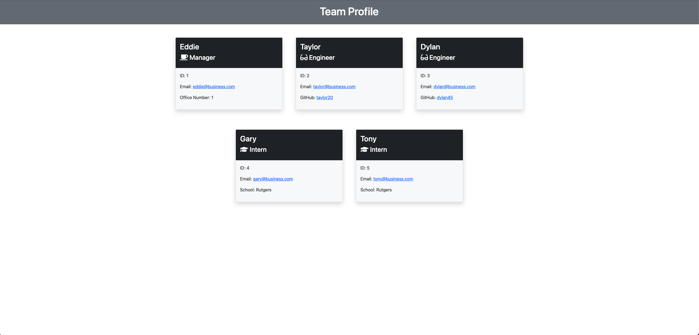

# Team Profile Generator

## Description

This application is designed to be a easy way to create a team profile page when working a project.

## Table of Contents

* [Installation](#installation)
* [Usage](#usage)

* [Tests](#tests)
* [Questions](#questions)

## Installation

To install this project clone the repository on your machine then from the root of the folder run npm install to have inquirer and jest installed.

## Usage

To use the application after you installed the required dependecies in the command line run node index.  A series of questions will then be prompted all required information starting with the manger. You have the option of adding more engineers or interns to it.

## Demonstration Video

https://drive.google.com/file/d/159eKz1uN7dl_D2ZFEbvsNnJHB7Yb5lCo/view

## Screenshot

## Tests
With jest installed all you have to do is run npm test from the command line.  There are currently 22 tests in the project.

## Questions

If you have any questions please reach out to me on GitHub at [https://github.com/emcarr22](https://github.com/emcarr22) or Email me at [e.mccarthy2285@gmail.com](mailto:e.mccarthy2285@gmail.com)